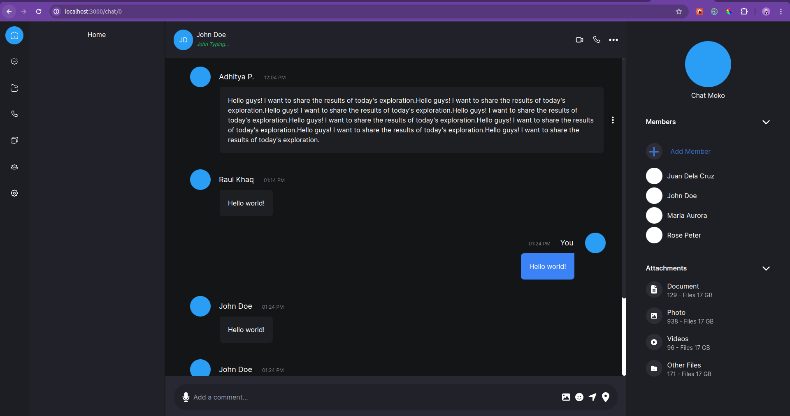

# ChatMoko || Messaging App

## INSTALLATION

1. **Install Node.js and npm**: Make sure you have Node.js and npm installed on your system. You can download and install them from [here](https://nodejs.org/).

2. **Create a Next.js Project**: Install dependencies:

   ```bash
   npm install
   ```

## CURRENT PROGRRESS


